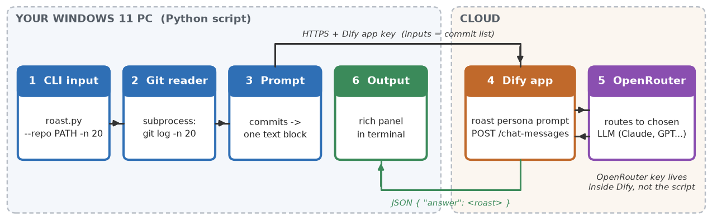

# Commit Roaster (AI-Project-1)

A Python command-line tool that reads the last 20 commit messages from a Git repo and has an LLM roast them.
The LLM runs behind a [Dify](https://dify.ai) app that uses an [OpenRouter](https://openrouter.ai) API key.



Proposal (one page): [`docs/Commit_Roaster_Proposal.docx`](docs/Commit_Roaster_Proposal.docx) / [`.pdf`](docs/Commit_Roaster_Proposal.pdf)

## Setup on Windows 11

1. **Clone** this repo, then open PowerShell in the repo folder.
2. **Run the setup script**. It prints your PC specs to `setup\system-info.txt`, installs Python 3.12, Git and VS Code with winget, creates `.venv`, installs `requirements.txt` and copies `.env.example` to `.env`:
   ```powershell
   powershell -ExecutionPolicy Bypass -File setup\setup_windows.ps1
   ```
   Flags: `-SkipInstall` only builds the venv. `-WithDocker` also installs Docker Desktop, which you only need to self-host Dify.
3. **OpenRouter**: create an API key at openrouter.ai/keys and set a credit limit.
4. **Dify** (Dify Cloud is easiest):
   - Go to Settings, then Model Providers, then OpenRouter, and paste the OpenRouter key.
   - Create a **Chat** app, choose the model **`nvidia/nemotron-3.5-lightning:free`** (Nemotron 3.5 Lightning, free), and give it a roast-persona system prompt. If it isn't in Dify's OpenRouter model list, add it by that exact ID.
   - Note: prompts sent to free OpenRouter endpoints may be logged by the provider. Don't roast repos that contain confidential commit messages.
   - Under **API Access**, create an API key (`app-...`) and paste it into `.env` as `DIFY_API_KEY`.
5. **Activate the venv**: `.venv\Scripts\Activate.ps1`. If PowerShell blocks it, run `Set-ExecutionPolicy -Scope CurrentUser RemoteSigned` once.

## Usage

```powershell
.venv\Scripts\Activate.ps1
python roast.py                          # roast the repo in the current folder
python roast.py --repo C:\code\my-app    # roast another repo
python roast.py -n 10                    # only the last 10 commits
python roast.py --dry-run                # show the prompt, don't call Dify
python roast.py --range main..HEAD       # only this branch's commits
```

## GitHub Action: roast every pull request

`.github/workflows/roast-pr.yml` roasts the commits in each pull request and posts the result as a PR comment, updating the same comment on new pushes.
To turn it on, add your Dify app key as a repository secret named `DIFY_API_KEY` (Settings > Secrets and variables > Actions).
If the secret is missing, or Dify is down, the workflow skips the roast without blocking the PR.

## Layout

```
roast.py                  The CLI: git log -> Dify -> roast in the terminal
setup/setup_windows.ps1   Windows 11 environment setup
.github/workflows/        GitHub Action that roasts each pull request
docs/                     Proposal (.docx/.pdf) and pipeline diagram
requirements.txt          requests, python-dotenv, rich
.env.example              Config template (copy to .env, never commit .env)
```
