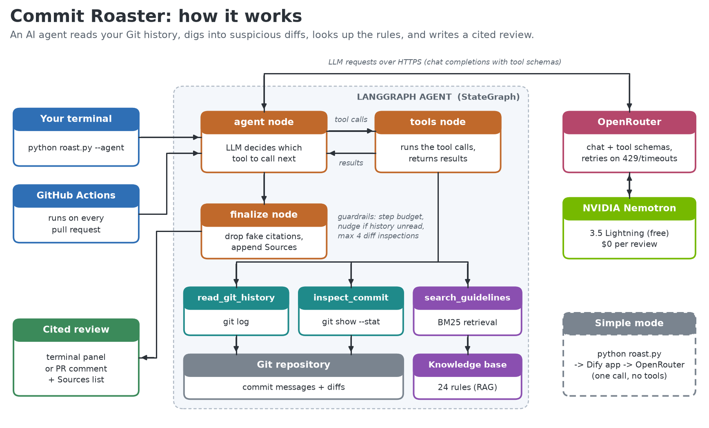

# Commit Roaster 🔥

[](https://github.com/xucaleb6335/AI-Project-1/actions/workflows/tests.yml)


We've all written a commit called `fix`. Maybe `wip`. Maybe, at 2am, `asdf please work`.

Commit Roaster is an AI agent that reads your Git history, opens up the commits that look suspicious, checks them against real commit-message guidelines, and then roasts you for them. It's funny, but it's also useful: every burn cites the rule you broke, and it suggests a better message for your worst commits.

It runs in your terminal, and it can also review every pull request automatically through GitHub Actions. The default model is NVIDIA Nemotron on OpenRouter's free tier, so a review costs $0.



## What a roast looks like

```
  tool call: read_git_history()
  tool call: inspect_commit(commit_hash='31f90eb')
  tool call: search_commit_guidelines(query='small tweak many files')
╭──────────────────────────────── Commit Roast ────────────────────────────────╮
│ [31f90eb] "small tweak" - It touched 10 files. That is not a tweak, that is  │
│ a renovation [BP-06].                                                        │
│                                                                              │
│ Verdict: This branch reads like a hostage note.                              │
│ Score: 2/10                                                                  │
│                                                                              │
│ Fixes:                                                                       │
│  • feat(core): add file generators for modules 0-3 [CC-03]                   │
│                                                                              │
│ Sources                                                                      │
│  • [BP-06] Match the message to the size of the change                       │
│  • [CC-03] Other common types                                                │
╰──────────────────────────────────────────────────────────────────────────────╯
```

## How it works

The agent is a [LangGraph](https://github.com/langchain-ai/langgraph) state graph (`commit_roaster/agent.py`). The model doesn't get your commits pasted into a prompt. It gets three tools and decides for itself how to use them:

| Tool | What it does |
|---|---|
| `read_git_history` | Runs `git log` on the repo (or just the PR's commits in CI) |
| `inspect_commit` | Runs `git show --stat` on one commit, so the agent can see that "small tweak" actually touched 40 files |
| `search_commit_guidelines` | Retrieval over a small knowledge base of Conventional Commits rules and commit best practices (BM25 ranking) |

That last tool is the RAG part. The knowledge base lives in [`knowledge/`](knowledge/) as plain Markdown, where every section is one retrievable chunk with an ID like `[BP-05]`. When the agent finishes, a `finalize` step strips any citation that doesn't exist in the knowledge base (models do make these up) and adds a Sources list.

A few guardrails keep a small free model from going off the rails:
- **Step budget:** after 8 rounds of tool calls, the agent has to write its answer.
- **Nudge:** if it tries to review without reading the history first, it gets told to go read it.
- **Diff limit:** it can open at most 4 diffs per run, and big diffs are truncated.
- **Retries:** rate limits (429) and timeouts are retried with backoff, and anything that still fails comes back as a readable error, not a stack trace.

There's also a **simple mode** (plain `python roast.py`) that sends the commit list to a [Dify](https://dify.ai) chat app in a single call. That's how this project started, and it's handy when you want to tweak the prompt in Dify's UI without touching code.

## Getting started (Windows 11)

1. Clone the repo and open PowerShell in the folder.
2. Run the setup script. It installs Python 3.12, Git and VS Code if you don't have them, creates a virtual environment, installs the dependencies and creates your `.env` file:
   ```powershell
   powershell -ExecutionPolicy Bypass -File setup\setup_windows.ps1
   ```
3. Get a free API key at [openrouter.ai/keys](https://openrouter.ai/keys) and put it in `.env` as `OPENROUTER_API_KEY`.
4. Activate the environment and roast something:
   ```powershell
   .venv\Scripts\Activate.ps1
   python roast.py --agent
   ```

If PowerShell refuses to run `Activate.ps1`, run `Set-ExecutionPolicy -Scope CurrentUser RemoteSigned` once. On macOS or Linux, skip the setup script and run `python -m venv .venv && .venv/bin/pip install -r requirements.txt`.

## Usage

```powershell
python roast.py --agent                         # the agent, on the current repo
python roast.py --agent --repo C:\code\my-app   # some other repo
python roast.py --agent -n 10                   # only the last 10 commits
python roast.py --agent --range main..HEAD      # only what's on your branch
python roast.py --agent --model nvidia/nemotron-3-super-120b-a12b:free   # try another model
python roast.py                                 # simple mode through Dify
python roast.py --dry-run                       # show what would be sent, call nothing
```

You can switch models with `OPENROUTER_MODEL` in `.env`; any OpenRouter model with tool-calling support works. Free models' prompts may be logged by the provider, so don't point this at a repo with confidential commit messages.

## Roasting pull requests automatically

[`.github/workflows/roast-pr.yml`](.github/workflows/roast-pr.yml) runs the agent on the commits in every pull request and posts the review as a comment. When you push more commits, it updates that same comment instead of adding a new one. To turn it on, add `OPENROUTER_API_KEY` as a repository secret (**Settings → Secrets and variables → Actions**). If the key is missing, or the model is having a bad day, the workflow skips quietly and never blocks a merge.

## Tests

```powershell
pip install -r requirements-dev.txt
python -m pytest
```

The tests don't call any real API. The agent is driven by a scripted fake model, and the HTTP tests run the real OpenAI client against a local fake OpenRouter server, so tool calling, 429 retries and auth errors are all tested over HTTP. They also run on every push via [`.github/workflows/tests.yml`](.github/workflows/tests.yml).

## Project layout

```
roast.py                     command-line entry point
commit_roaster/agent.py      LangGraph agent, tools, guardrails, citation check
commit_roaster/knowledge.py  knowledge base loading + BM25 retrieval (RAG)
commit_roaster/git_tools.py  git log / git show helpers
commit_roaster/dify.py       simple mode (Dify chat app)
knowledge/                   the guidelines the agent cites
tests/                       pytest suite
.github/workflows/           PR roaster + test CI
setup/setup_windows.ps1      one-command Windows setup
docs/                        architecture diagram and the original project proposal
```
